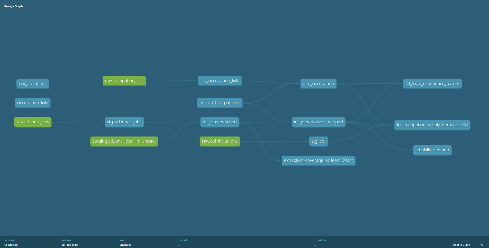

# AU Migration & Jobs Radar

> An end-to-end analytics product that quantifies the gap between Australia's
> skilled migration occupation lists (MLTSSL / STSOL / CSOL) and the real
> labour market — built for visa applicants navigating their next move.

---

## The problem

Australia's skilled migration occupation lists name 80+ technology roles
eligible for sponsorship, but Home Affairs publishes no integrated view
of how those roles actually map to current job-market demand,
local-experience expectations, or skill requirements. International
candidates pick an ANZSCO code without seeing whether the market behind
it is hiring at all, whether postings filter on "Australian experience",
or which technologies recur in the JD text.

This project closes that information gap for the Visa Applicant view.

---

## What it answers

1. **Supply vs. competition** — For each MLTSSL ANZSCO code, how many
   Adzuna postings exist over the past 30 days versus the Home Affairs
   SkillSelect occupation ceiling for PY 2025/26 and the actual grants
   issued in PY 2024/25. Two derived ratios surface the favourable and
   adverse signals.
2. **Local-experience barrier** — The share of postings whose text
   explicitly requires Australian or local work experience, broken down
   by occupation and state.
3. **JD signals via LLM** — Required skills, minimum years of
   experience, sponsorship intent, local-experience requirement, and
   work-mode extracted from each job description by Qwen-Turbo.

---

## Three findings (v1)

- **Software Engineer is the visa-applicant sweet spot.** It carries
  the largest market — 455 active roles over 30 days — and the lowest
  local-experience requirement (≈ 0.5%) among the populated
  occupations. The Q1 four-quadrant scatter places it in the
  bottom-right "high supply, light competition" quadrant.
- **Software Tester and Computer Network and Systems Engineer face the
  highest local-experience barrier.** Both sit above 3.5% of postings
  explicitly requiring AU work history — roughly seven times the rate
  for Software Engineer roles. International candidates targeting these
  ANZSCO codes face a meaningful entry premium.
- **Platform and CRM skills outrank programming languages in AU IT
  advertising.** AWS, Azure, and Salesforce lead the extracted-skills
  chart; Python, Java, and SQL fall behind. The pattern suggests
  Australian employers advertise *systems they run* more often than
  *languages they use*.

---

## Architecture

```
+--------------+    +-----+    +----------+    +---------------+    +----------+
| Adzuna API   | -> | GCS | -> | BigQuery | -> | dbt Core      | -> | Power BI |
| Home Affairs |    |     |    | raw      |    | staging       |    | report   |
| DashScope    |    |     |    |          |    | intermediate  |    |          |
| (Qwen-Turbo) |    |     |    |          |    | marts         |    |          |
+--------------+    +-----+    +----------+    +---------------+    +----------+
```

### dbt lineage

<p align="center">
  
</p>

The warehouse follows a three-layer dbt pattern. Staging models clean
and rename. Intermediate models enrich Adzuna postings with LLM
extraction (`staging.adzuna_jobs_llm_extract`) and map free-text job
titles to ANZSCO codes via `anzsco_title_patterns`. Marts surface four
analytics-ready outputs:

- `dim_occupation` — conformed ANZSCO dimension with MLTSSL / STSOL /
  CSOL membership flags.
- `fct_occupation_supply_demand_30d` — Q1 supply (Adzuna jobs) joined
  with PY25/26 ceiling and PY24/25 grants at the 4-digit unit-group
  level.
- `fct_local_experience_barrier` — Q2 share of postings requiring local
  work experience, per (occupation, state).
- `fct_skills_demand` — Q3 unnested skill mentions by state.

A custom singular test enforces ≥ 90% LLM-extraction coverage; 51
data tests pass end-to-end.

---

## Tech stack

| Concern | Tool |
|---|---|
| Ingestion | Python 3.11+ · httpx · tenacity · Adzuna API |
| Object storage | Google Cloud Storage (gzipped JSONL, partitioned by snapshot date) |
| Warehouse | Google BigQuery (raw / staging / marts) |
| Transformation | dbt Core 1.11 · dbt-bigquery · dbt-utils |
| LLM extraction | Qwen-Turbo via Alibaba DashScope (OpenAI-compatible endpoint) |
| LLM-as-judge eval | Qwen-Plus, with per-field accuracy scoring |
| BI | Power BI Desktop (theme imported via JSON) |
| Code & data versioning | Git / GitHub |

---

## Dashboard

The Visa Applicant View is a single Power BI page with three KPI cards,
two paired bar charts, a Q1 four-quadrant scatter, and a state map. A
second page documents methodology and limitations.

`Publish to web` is restricted on the available Power BI Service
account, so v1 ships as high-resolution PNG screenshots under
`screenshots/` rather than an embed link.

<p align="center">
  
</p>

---

## Limitations

- **JD truncation.** Adzuna's search API truncates descriptions at
  ≈ 500 characters, so roughly 90% of postings do not reach an explicit
  skills section. The skills chart reads as "what survives in the first
  500 characters", not "what the role requires overall".
- **Unit-group ceiling.** Home Affairs publishes occupation ceilings at
  the 4-digit ANZSCO unit-group level, not the 6-digit code. Software
  Engineer (261313), Developer Programmer (261312), Analyst Programmer
  (261311), and Software Tester (261314) all share the 2613 unit-group
  ceiling of 912 invitations.
- **ANZSCO mapping coverage.** A regex title-pattern dictionary maps
  approximately 1,010 of 3,975 postings to a recognised ANZSCO code;
  the remaining 2,965 are excluded from per-occupation aggregations.
- **LLM-as-judge calibration.** Qwen-Plus was used as the evaluation
  judge and reaches 95.9% per-field accuracy on a 50-row sample.
  Observed edge cases include the judge conflating "certification
  sponsorship" with visa sponsorship in one case.

---

## How to run

The pipeline is reproducible end to end. Prerequisites: a GCP project
with BigQuery enabled, an Adzuna developer account, and a DashScope
(international tenant for free quota) API key.

```bash
# 1. Sync dependencies
uv sync --all-extras

# 2. Configure environment
cp .env.example .env
# Fill in Adzuna keys, GCP project id, DashScope key, etc.

# 3. Run the source-data sanity check
uv run python scripts/verify_adzuna_source.py --where "Melbourne,Sydney,Brisbane"

# 4. Ingest job postings to GCS and BigQuery
uv run --env-file .env python scripts/ingest_adzuna.py --replace-partition

# 5. Extract structured LLM signals
uv run --env-file .env python scripts/extract_llm_signals.py --concurrency 5

# 6. Build the warehouse
uv run --env-file .env dbt build --project-dir dbt --profiles-dir dbt

# 7. (Optional) Re-evaluate extraction quality
uv run --env-file .env python scripts/evaluate_extraction.py --sample-size 50

# 8. Open the Power BI report (.pbix; gitignored) and refresh
```

Step-by-step setup guides for each layer live in `docs/`:
`gcp-setup-guide.md`, `powerbi-setup-guide.md`,
`powerbi-dashboard-guide.md`, and `powerbi-polish-guide.md`.

---

## Repository layout

```
.
├── adzuna_pipeline/         # Python ingestion + LLM extraction package
│   ├── client.py            # Adzuna httpx client with retry
│   ├── storage.py           # GCS uploader (gzipped JSONL)
│   ├── loader.py            # BigQuery loader with explicit schema
│   ├── config.py            # Pydantic settings layer
│   └── extraction/          # Qwen extraction + judge sub-package
├── dbt/                     # dbt project (staging / intermediate / marts)
│   ├── models/
│   ├── seeds/               # anzsco_title_patterns, occupation_ceilings, ...
│   ├── macros/
│   └── tests/               # custom singular tests
├── scripts/                 # Typer CLIs (verify, ingest, extract, evaluate)
├── docs/                    # setup and polish guides + theme JSON
├── screenshots/             # dashboard exports for README and LinkedIn
├── pyproject.toml           # uv-managed Python deps
├── .env.example             # env-var template
└── dev_log.txt              # reverse-chronological project changelog
```

---

## About me

Master of Data Science from the University of Melbourne, with prior
industry-collaboration experience at SANDSTAR (Power BI dashboards
adopted by company leadership for strategic communication) and Metro
Trains Melbourne (PostgreSQL/PostGIS spatial database design). LLM
evaluation experience at iFLYTEK Smart City. Open to data analyst,
data engineer, and analytics engineer roles in Melbourne.
