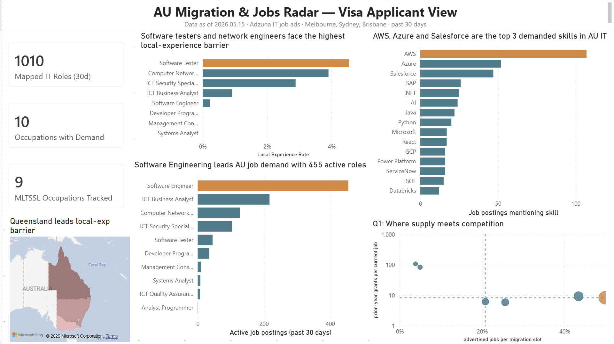

# 技术移民 + 澳洲招聘市场仪表板 — 14 天 MVP 落地方案（修订版）

> **项目代号**：`au-migration-jobs-radar`
> **定位**：在 14 天内交付可上简历、可投递时附链接的 portfolio 项目；基于真实使用反馈再决定是否扩展。
> **核心思路**：先有人看见，再做得更深。

---

## 一、项目背景与动机

### 1.1 我已有的本地基础

我已经具备的本地资产（这个项目是补充，不是从零起步）：

- 墨尔本大学 Bachelor + Master of Data Science
- **SANDSTAR Pty Ltd** 的 Power BI dashboard 项目，被对方高层采用做战略沟通
- **Metro Trains Melbourne (MTM)** 的 PostgreSQL/PostGIS 空间数据库设计项目
- iFLYTEK 智慧城市部门的 LLM evaluation + RAG / vector retrieval 经验

这个项目要补的具体技术栈空缺是：**云端数据仓库（BigQuery）+ 现代转换层（dbt）+ 端到端 portfolio 故事**。

### 1.2 项目的商业问题（不是个人求职焦虑）

澳洲技能移民职业清单（MLTSSL / STSOL / CSOL）每年由 Home Affairs 发布，但**这些清单上的职业在劳动力市场上的真实需求、竞争激烈度、雇主担保意愿没有公开整合的数据**。

这是一个真实存在的信息缺口，影响三类人：签证申请人、移民/留学顾问、雇主。

**写 README 和 LinkedIn 文章时，开篇只讲这个商业问题，不提我个人求职。** 招聘官点进来看到的是一个产品，不是一个人的焦虑。

### 1.3 这个项目要在面试中证明什么

- 能把模糊问题拆成可量化指标（**问题定义**）
- 能用 BigQuery + dbt 做规范的多层数据建模（**现代数据栈实操**）
- 能用 Qwen 做 JD 结构化抽取，延续 iFLYTEK 的 LLM 评估能力（**LLM 应用**）
- 能用 Power BI 做有 storytelling 的 dashboard（**可视化**）
- 能写给非技术读者的 insight 文章（**沟通**）

---

## 二、v1 范围（严格刚性）

### 2.1 只做一个 stakeholder 视图

**Visa Applicant View**（签证申请人视角）。其他两个视图（Migration Advisor / Employer）暂不做。

### 2.2 只回答 3 个核心问题

**Q1 — 清单 vs 现实供需比**
我的 ANZSCO code 在 MLTSSL 上，但过去 30 天 Adzuna 上有多少职位？同期 EOI 邀请数（作为竞争激烈度代理指标）多少？

**Q2 — Local experience 门槛（原 Q4）**
JD 中明确要求 "Australian experience" / "local experience" / "AU citizen/PR only" 的比例。按职业、按州拆分。哪些角色对国际背景最友好？

**Q3 — JD 关键技能与 sponsorship 信号 LLM 抽取（原 Q13）**
用 Qwen 从 JD 里抽：核心技能、年限要求、是否接受 sponsorship、是否接受 visa、是否远程。落到结构化字段。

### 2.3 不在 v1 范围内的事

明确写出来，避免 scope creep：

- 三视图全部、其余 12 个商业问题
- Airflow 编排（用 GitHub Actions cron 替代）
- 周更 / 日更（v1 是 one-time snapshot）
- 中文版小红书 / 知乎文章（先发英文 LinkedIn，反响好再翻译）
- 自动化数据健康监控（v1 用一个静态截图代替）
- 自定义域名 / 个人网站

---

## 三、Day 0 — Go / No-Go 检查点（动手前必做）

**在投入任何代码之前**，第一天先做这件事，最长不超过半天：

1. 注册 Adzuna API（[https://developer.adzuna.com/](https://developer.adzuna.com/)），拿到 app_id 和 app_key
2. 用 `/v1/api/jobs/au/search/1` 端点，过滤参数 `where=Melbourne`、`category=it-jobs`、`max_days_old=30`，看返回的 `count` 字段
3. 翻页取前 5 页（每页 50 条），导出成 CSV，肉眼检查字段质量

**Go 标准**（满足任意一条就继续）：

- 墨尔本 IT 类过去 30 天职位数 ≥ 1500
- 字段完整：title、description、location、salary（哪怕只有 30%）、company、created
- 至少能识别出 ANZSCO 大类（IT 类基本对应 26xxxx）

**No-Go 应对**：

- 数据量 < 1500：把范围扩到全澳 + 全行业，重新评估
- 字段质量差：考虑改用 data.gov.au 上的 Job Outlook + ABS Labour Force 季度数据做静态分析（项目改名为"澳洲技能移民职业市场静态分析"，故事线略调整但不需要重写）
- Adzuna 完全不可用：直接放弃这个项目，转 Coles vs Woolworths 通胀仪表板提前到现在

**这个 checkpoint 的意义**：避免我在没验证数据可用性的情况下花 13 天做出来一个数据不够的项目。

---

## 四、技术栈选择与理由

| 层 | 选型 | 月度成本 | 选它的理由 |
|---|---|---|---|
| 采集 | Python + httpx | $0 | 我已有基础 |
| 原始存储 | GCS bucket | $0（free tier） | 配 BigQuery 顺手 |
| 数据仓库 | BigQuery | $0（1TB query/月免费） | **补足"cloud DW"简历标签** |
| 转换 | dbt Core + dbt-bigquery | $0 | **补足"现代数据栈"简历标签**；v1 就用 |
| 编排 | GitHub Actions cron | $0 | v1 不需要 Airflow，cron 够用 |
| LLM | Qwen-Turbo via DashScope | <¥2 总成本 | **延续 iFLYTEK 故事链**；几乎免费 |
| BI | Power BI Desktop（免费）+ Publish to Web | $0 | 我有基础；澳洲 JD 高频 |
| 代码托管 | GitHub | $0 | 标配 |

**总成本：< $1 USD（一次性）**，这是 14 天 MVP 阶段。

**关于 Qwen 和 LLM 选型故事**：在 iFLYTEK 我 benchmark 了 Qwen3-235B-Instruct 和 Qwen3-30B-A3B 等 4 个模型用于 summarization 和 daily-digest。这个项目用 Qwen-Turbo（同一家族的小模型）做 JD 字段抽取——是一个"我把上一份实习的 LLM 评估能力，应用到新领域里更轻量的推理任务"的连贯故事。面试时可以讲：为什么选 Qwen-Turbo 而不是 Qwen3-235B（速度 / 成本 / 任务难度匹配）。

---

## 五、14 天 Day-by-Day 计划

每天预算 3-4 小时项目工作 + 留出时间继续投简历。

### Week 1 — 数据 + 模型骨架

**Day 0（周日，半天）— Go/No-Go**
- Adzuna 注册 + 数据量验证（见第三节）
- 决定继续 / 调整 / 放弃

**Day 1 — 项目初始化**
- 建 GitHub repo，写一个最小 README（仅项目目标 + 一句话 stakeholder 描述）
- 建 GCP 项目 + 启用 BigQuery API + 建 raw / staging / marts 三个 dataset
- 装 dbt-bigquery，跑通 `dbt debug`

**Day 2 — 数据采集**
- Python 脚本：Adzuna 拉取墨尔本 + 悉尼 + 布里斯班 IT 类过去 30 天职位
- 落 GCS（按日期分区的 JSONL 文件）
- 加载到 BigQuery `raw.adzuna_jobs`
- 手动整理 MLTSSL CSV → 上传到 BigQuery `raw.occupation_lists`
- 手动从 Home Affairs 抄 EOI 邀请数据（最近 6 个月）→ `raw.eoi_invitations`

**Day 3 — Staging 层**
- `stg_adzuna__jobs.sql`：清洗、字段重命名、类型转换、地理位置标准化
- `stg_occupation_lists.sql`、`stg_eoi.sql`
- 加 5 个基础 dbt tests：not_null、unique、accepted_values（state 字段）

**Day 4 — Intermediate 层 + LLM 抽取（最难一天）**
- 写 LLM 抽取 Python 脚本：调 DashScope Qwen-Turbo，输入 JD 文本，输出 JSON（`required_skills`、`years_experience`、`sponsorship_signal`、`local_experience_required`、`remote_friendly`）
- 先在 100 条样本上手工核对准确率，prompt 迭代到 ≥ 80% 正确
- 批量跑全部职位，结果写回 `int_jobs_enriched` 表
- 加 dbt 测试：抽取出的字段不能全为 null

**Day 5 — Marts 层（Q1 + Q2）**
- `fct_occupation_supply_demand_30d.sql`：每个 ANZSCO code 30 天职位数 + EOI 邀请数 + 供需比
- `fct_local_experience_barrier.sql`：每个职业 / 州的 local-experience-required 比例
- 跑 `dbt build`，确认所有测试通过
- 截图 dbt docs 的 lineage graph 留作 README 素材

### Week 2 — 可视化 + 内容产出

**Day 6 — Power BI 数据连接 + 第一张图**
- Power BI Desktop 连 BigQuery
- 建第一个 visual：按 ANZSCO 排序的 supply-demand bar chart（Q1）
- 试公布到 Power BI Service（Publish to Web）

**Day 7 — Power BI 主仪表板**
- 完成 1 个完整页面，包含：
  - 顶部 KPI 卡（总职位数、覆盖职业数、数据时效）
  - 中部地图（按州热力）+ 四象限气泡图
  - 底部 LLM 抽取关键技能词云 / 条形图
- 每个图表标题都是一句**洞察**，不是字段名（比如 "Melbourne data analyst roles: 38% require local experience" 而不是 "Local Experience by Role"）

**Day 8 — Power BI 打磨 + 截图**
- 配色统一（推荐：低饱和蓝绿主色 + 橙色高亮）
- 加 Methodology 子页面：写清楚数据源、时间窗口、3 个 limitation
- 截 4-6 张高分辨率截图存到 GitHub repo `/screenshots/`
- 拿到 Publish to Web 公开链接

**Day 9 — README 重写**
- 按第七节模板重写 README
- 第一屏必须有：live link、screenshot、tech stack 表
- 三个 finding 用一句话各概括一次

**Day 10 — LinkedIn 文章草稿**
- 800 字，结构见第八节
- 配 2 张 dashboard 截图
- 用 Grammarly 或类似工具校对英文

**Day 11 — 简历更新**
- 项目栏加这一项（措辞见第九节）
- 关键：把这个项目放在 SANDSTAR 项目**之后**，强调"补充现代数据栈"
- 同时优化 SANDSTAR 那条——之前的"adopted by company leadership for strategic communication"是金句，确保突出

**Day 12 — 同行评审**
- 找 1-2 个朋友 / 同学（最好有澳洲求职经验）看 dashboard 链接和 LinkedIn 文章草稿
- 收集"3 秒内能 get 到核心价值吗"的反馈
- 修改至少 1 轮

**Day 13 — 发布**
- LinkedIn 文章正式发出（早上 9 点墨尔本时间，工作日）
- repo 公开
- 简历更新 + 上传到 LinkedIn / Seek profile

**Day 14 — 投递日**
- 当天用更新后的简历投至少 10 份岗位
- 在每份岗位的 cover letter 里点出 dashboard 链接
- 把这一天定义为"项目正式上线"

---

## 六、dbt 数据模型（v1 极简版）

```
raw/
  adzuna_jobs                  -- 原始 API 返回 JSON 落表
  occupation_lists             -- 手动整理的 MLTSSL/STSOL/CSOL
  eoi_invitations              -- Home Affairs 公开 EOI 数据

staging/
  stg_adzuna__jobs             -- 清洗、字段重命名
  stg_occupation_lists         -- 标准化为长表
  stg_eoi                      -- 时间序列化

intermediate/
  int_jobs_enriched            -- 加上 Qwen 抽取字段
  int_jobs_geocoded            -- 州 / 城市 / 区域分类

marts/
  fct_occupation_supply_demand_30d
  fct_local_experience_barrier
  dim_occupation               -- 职业维度（清单状态 + ANZSCO 描述）

tests/
  schema.yml — 至少 8 个测试：
    - 4 个 unique + not_null（fact 表 grain）
    - 1 个 accepted_values（state 字段限定值）
    - 1 个 relationship（ANZSCO code 必须在 dim_occupation 里）
    - 1 个 expression_is_true（薪资在 30k-500k 范围内）
    - 1 个自定义 test（int_jobs_enriched 中至少 90% 行有 LLM 抽取结果）
```

---

## 七、README 模板（recruiter-friendly，5 秒上手）

```markdown
# AU Migration & Jobs Radar

> An end-to-end analytics product that quantifies the gap between
> Australia's skilled migration occupation lists and the real labour
> market — for visa applicants planning their next move.

🔗 **Live Dashboard**: [Power BI link]
📰 **Read the analysis**: [LinkedIn article]
👤 **Built by**: Sunmao Wang — [LinkedIn](...) | [Resume](...)

---



## What this answers (v1)

1. Which MLTSSL occupations have the strongest market demand vs.
   competition? (supply-demand ratio)
2. Which roles have the lowest "local experience" entry barrier for
   international candidates?
3. What skills, seniority, and sponsorship signals do AU job ads
   actually contain? (LLM-extracted from 5,000+ JDs)

## Tech Stack

| Layer | Tool |
|---|---|
| Ingestion | Python + Adzuna API |
| Cloud DW | Google BigQuery |
| Transformation | dbt Core (8+ tests) |
| LLM extraction | Qwen-Turbo (DashScope) |
| BI | Power BI |

## Data Lineage


## Findings (excerpt)

- [One-sentence finding 1]
- [One-sentence finding 2]
- [One-sentence finding 3]

[Full write-up →](LinkedIn link)

## Limitations

- Adzuna does not cover 100% of AU listings
- 30-day snapshot — trend analysis limited
- LLM extraction validated on 100-sample manual review (~85% accuracy)

## How to run

[3-step instructions]

## About me

Master of Data Science from University of Melbourne, with prior
industry-collaboration experience at SANDSTAR (Power BI dashboards
adopted by company leadership) and Metro Trains Melbourne (PostGIS
spatial database). Open to data analyst / data engineer roles in
Melbourne.
```

---

## 八、LinkedIn 文章大纲（800 字）

**标题**：*I analysed 5,000 Australian tech job ads. Here's what the skilled migration list quietly gets wrong.*

**第 1 段（80 字 hook）**：直接抛事实。"Australia's MLTSSL has 80+ tech occupations. Over the past 30 days, X of them had fewer than 50 active job listings nationwide."

**第 2 段（100 字方法论）**：5,000 条 Adzuna 职位、Qwen-Turbo 抽取、BigQuery 建模。链接 GitHub。

**第 3 段（200 字 Finding 1 — 清单陷阱）**：列出 3 个具体职业代码 + 30 天职位数 + EOI 邀请数。读者看到 "263213 ICT Quality Assurance Engineer 上 MLTSSL，过去 30 天全澳 X 个职位"会震惊。

**第 4 段（200 字 Finding 2 — Local experience 门槛）**：哪些 ANZSCO code 的 JD 里 "local experience required" 比例最低（< 20%）？这是给国际背景候选人的甜蜜区。

**第 5 段（150 字 Finding 3 — 跨州差异）**：墨尔本 vs 悉尼 / 布里斯班，同一职业薪资 vs sponsorship 接受度的 trade-off 数据。

**第 6 段（70 字 CTA）**：dashboard 公开链接 + GitHub + "如果你在做澳洲技能移民方向决策，这个工具可能有帮助"。

---

## 九、简历上的写法

```
AU Migration & Jobs Radar — Personal Analytics Product            2026
• Designed and shipped an end-to-end analytics product analysing
  5,000+ Australian tech job ads to quantify the gap between the
  skilled migration occupation list and real market demand.
• Architected a BigQuery + dbt warehouse with three-layer modelling
  (staging / intermediate / marts) and 8+ data tests; LLM-based JD
  field extraction using Qwen-Turbo (extending evaluation experience
  from iFLYTEK).
• Built a Power BI dashboard published to web; supporting LinkedIn
  long-form analysis received [N] impressions.
Tech: Python · BigQuery · dbt · Qwen API · Power BI · GitHub Actions
```

---

## 十、风险与真实 mitigation

| 风险 | 概率 | 影响 | 真实 mitigation（不是空话） |
|---|---|---|---|
| 14 天没做完 | 中 | 高 | Day 7 强制 review：如果没到当日里程碑，立即砍范围（先砍 LLM，再砍 Q3，再砍 Power BI 美化），但 14 天必须有东西 |
| Adzuna 数据量不够 | 中 | 高 | Day 0 已经验证；不达标直接转 data.gov.au + ABS 静态分析方案 |
| LLM 抽取准确率低 | 中 | 中 | 100 条手工标注先做基线评估；不到 80% 就降级为正则关键词匹配 |
| BigQuery 学习成本 | 低 | 低 | 用过 PostgreSQL，SQL 90% 一致；setup 30 分钟 |
| dbt 学习成本 | 低 | 中 | Day 1-3 集中学习；如果 Day 4 还卡，降级用纯 SQL + Python，不强求 dbt |
| Power BI 不熟 | 低 | 低 | 已有基础；遇到难题用 dashboard 简单设计兜底 |
| LinkedIn 文章没人看 | 高 | 中 | 接受这是正常的；改投策略——把 link 直接放进每份 cover letter，主动触达 |
| 我在 Day 7 想加更多功能 | 高 | 高 | 写在墙上："scope creep is the failure mode"；任何新功能都进 Layer 2 列表 |

---

## 十一、Layer 2 — 条件触发扩展（不预设时间）

**只在以下情况之一发生时，才考虑动 Layer 2**：

- **触发 A**（项目效果不足）：v1 上线 4 周后，简历回复率没有可见提升 → 加 Migration Advisor 视图 + 上 Airflow 周更 + 加雇主集中度分析
- **触发 B**（面试反馈深度不够）：拿到 ≥ 2 个面试，但反馈"项目深度有限" → 加 Employer 视图 + 上 Snowflake 做技术栈对比展示
- **触发 C**（项目本身有人用）：LinkedIn 文章 > 5000 impressions 或收到 ≥ 3 个用户反馈 → 考虑 cross-border / 国际背景视角（v1 砍掉的 Q14）

**绝不做**：在 v1 还没上线之前预先承诺任何 Layer 2 工作。

---

## 十二、成功指标（修订版）

### Portfolio 指标（这才是真实信号）

- 简历投递回复率：v1 上线后 4 周对比基线
- LinkedIn 文章 impressions ≥ 3000（保守）
- inbound recruiter / hiring manager 消息 ≥ 2 条
- 至少 1 次面试中被对方主动问到这个项目

### 项目本身指标

- v1 准时上线（Day 14）
- dbt 测试 100% 通过
- LLM 抽取 100 条样本人工评估准确率 ≥ 80%
- dashboard 加载时间 ≤ 5 秒

### 不再追的指标

- ~~GitHub stars ≥ 30~~（招聘官不看）
- ~~v1 数据覆盖 ≥ 5 万条~~（5000 条够回答 3 个问题）
- ~~3 个 stakeholder 视图~~（v1 只 1 个）

---

## 十三、立即开始的 3 件事（今天就能做）

1. 注册 Adzuna API（10 分钟）
2. 用 curl 或 Postman 拉一次 Melbourne IT 类职位，看 count（20 分钟）
3. 在日历上把未来 14 天的每天 3-4 小时锁死，命名为 "Jobs Radar v1"（10 分钟）

---

> **元判断**：这版方案最大的不同是把"完美"换成了"按时上线 + 按反馈迭代"。
> 14 天后我会有一个能放简历、能投递时附链接、有真实数据故事的产品。
> 至于它是否要长成原方案那个三视图的样子，等真实反馈说话。
